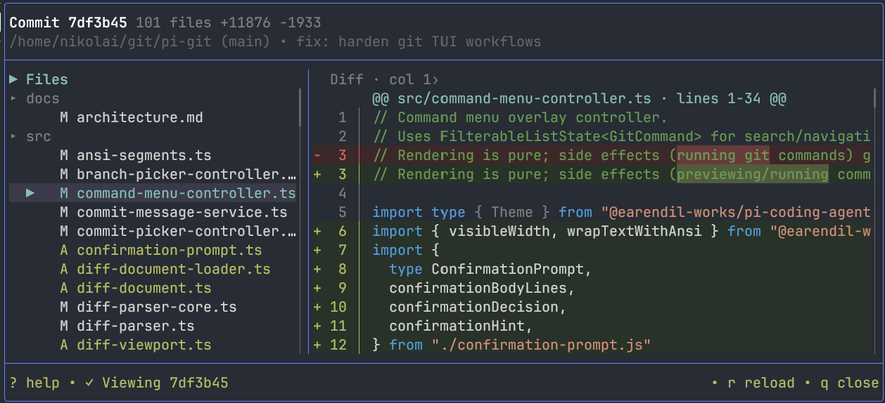

<p>
  
</p>

# Pi Git

A GitHub Desktop-style diff, staging, history, and commit workflow inside [Pi](https://github.com/badlogic/pi-mono).

Review syntax-highlighted changes, move files between the working tree and index, browse commits, manage branches and stashes, and commit without leaving Pi.

## Why This Exists

Pi is already where the code changes happen. Reviewing those changes should not require switching to another app or reconstructing the state of the index from terminal commands.

`pi-git` adds one full-screen `/diff` view with:

- a file tree and responsive diff viewport;
- separate, index-exact working and staged views;
- syntax highlighting with GitHub Desktop-style intraline changes;
- commit history, branch, stash, and worktree pickers;
- guarded Git commands and recoverable async operations.

Normal Git operations stay local. The model is only involved when you explicitly ask Pi to generate a commit message.

## Install

```bash
pi install git:github.com/NikolaiUgelvik/pi-git
```

Restart Pi after installation.

## Quick Start

Open the viewer from any directory inside a Git repository:

```text
/diff
```

Or use the global shortcut:

| Platform | Shortcut |
|----------|----------|
| macOS | <kbd>Cmd</kbd> + <kbd>Shift</kbd> + <kbd>G</kbd> |
| Linux / Windows | <kbd>Ctrl</kbd> + <kbd>Shift</kbd> + <kbd>G</kbd> |

The viewer opens on working-tree changes. Press <kbd>?</kbd> or <kbd>F1</kbd> at any time for context-sensitive help.

## Everyday Workflow

| Key | What it does |
|-----|--------------|
| <kbd>Tab</kbd> | Switch between the file tree and diff |
| <kbd>↑</kbd>/<kbd>↓</kbd> or <kbd>j</kbd>/<kbd>k</kbd> | Move through files or scroll the diff |
| <kbd>n</kbd>/<kbd>p</kbd> | Select the next or previous file |
| <kbd>v</kbd> | Toggle working and staged views |
| <kbd>Enter</kbd> | Stage the selected working file or unstage the selected staged file |
| <kbd>Shift</kbd>+<kbd>Enter</kbd> | Stage all remaining changes or unstage everything |
| <kbd>C</kbd> | Review staged changes; press again to open the commit dialog |
| <kbd>c</kbd> | Browse the working tree and recent commits |
| <kbd>Ctrl</kbd>+<kbd>P</kbd> | Open the Git command menu |
| <kbd>r</kbd> | Reload the active diff or retry a failed refresh |
| <kbd>?</kbd> / <kbd>F1</kbd> | Open context-sensitive help |
| <kbd>q</kbd> / <kbd>Esc</kbd> | Close the viewer or active overlay |

The diff viewport also supports half-page scrolling, fixed line-number gutters, horizontal scrolling with the arrow keys, and larger horizontal jumps with <kbd>Shift</kbd>+<kbd>←</kbd>/<kbd>→</kbd>.

## Staging and Committing

The working and staged views come directly from Git. `pi-git` does not approximate one from the other, so partially staged and mixed files remain accurate.

A typical commit flow:

1. Select a file and press <kbd>Enter</kbd> to stage its remaining changes.
2. Press <kbd>v</kbd> to inspect the exact staged diff.
3. Press <kbd>C</kbd> to enter staged review, then <kbd>C</kbd> again to compose the commit.
4. Type a message, or press <kbd>Ctrl</kbd>+<kbd>G</kbd> to generate one from the staged diff.
5. Press <kbd>Enter</kbd> to commit.

Inside the commit dialog, <kbd>Ctrl</kbd>+<kbd>X</kbd> toggles amend mode. Normal commits are blocked when the index is empty; amend remains available when the repository has an existing `HEAD`.

## History and Repository Tools

### Commit history

Press <kbd>c</kbd> to search recent commits by hash or message. Select a commit to inspect its diff, then press <kbd>W</kbd> to return directly to the working tree.

### Branches, worktrees, and stashes

| Key | Tool |
|-----|------|
| <kbd>b</kbd> | Search and switch branches; <kbd>Ctrl</kbd>+<kbd>N</kbd> creates one |
| <kbd>w</kbd> | Search and switch worktrees |
| <kbd>s</kbd> | Create, apply, pop, or drop stashes |
| <kbd>D</kbd> | Review and confirm discarding the selected working-tree file |
| <kbd>I</kbd> | Initialize Git when the current directory is not a repository |

### Git command menu

Press <kbd>Ctrl</kbd>+<kbd>P</kbd> to search and run common commands:

- fetch, fetch with prune, or fetch all remotes;
- pull, fast-forward-only pull, or pull with rebase;
- push, push tags, or force-push with lease;
- initialize and update submodules.

Force-push always performs a porcelain dry run, shows the resolved destination and ref updates, and requires a second confirmation before execution.

## Diff Rendering

- Syntax highlighting is resolved from each file path, including renamed files.
- Added and deleted blocks use subtle theme backgrounds while intraline changes use a stronger shade.
- Intraline highlighting follows GitHub Desktop's behavior: equal-sized change blocks are paired by position, then the common prefix and suffix are removed to reveal one changed range.
- Tabs, combining characters, CJK text, emoji, and wide graphemes remain safe during horizontal slicing.
- Unsupported, binary, malformed, and oversized inputs fall back to a bounded plain presentation.
- Narrow terminals switch to a single focused panel instead of squeezing both panes together.

## Safety

Git state can change while a command is running, so the viewer treats every load and mutation as an explicit operation:

- destructive actions require confirmation;
- Escape cancels active observation and triggers reconciliation when a mutation may already have taken effect;
- failed post-mutation refreshes retry the refresh only—the Git mutation is never run twice;
- stale async results cannot overwrite a newer repository, worktree, or document;
- large files and diffs stay visible as `(omitted)` entries with the measured limit and reason instead of being truncated mid-hunk;
- Git commands use bounded local, mutation, and network timeouts.

## How It Works

1. `/diff` captures one strict porcelain-v2 repository snapshot.
2. Staged and working patches are loaded as separate bounded slices.
3. Parsed files become immutable presentation rows with syntax and intraline styling.
4. Tree, presentation, and filtered-list caches keep navigation and scrolling responsive.
5. A single operation coordinator serializes loads, mutations, cancellation, reconciliation, and refresh-only recovery.

See [`docs/architecture.md`](docs/architecture.md) for the full state model, Git boundaries, rendering pipeline, and testing strategy.

## Development

Run the extension directly from source:

```bash
npm install
npm run dev
```

Useful development commands:

```bash
# Persistent type checking
npm run typecheck:watch

# One test file or the full suite in watch mode
npm run test:file -- tests/diff-intraline.test.ts
npm run test:watch

# Full repository checks
npm test
npm run check

# Rebuild and independently verify committed production output
npm run build
npm run verify:build
```

Git installs use the committed `dist/` tree. `npm run verify:build` performs an isolated clean rebuild and byte-compares all production files so stale or mixed output fails before release.

Performance fixtures are available through `benchmark:git`, `benchmark:render`, `benchmark:load`, and `benchmark:loop`.

## Limitations

- Staging operates on the selected file's remaining changes or the full active slice; interactive hunk/line staging is not currently exposed.
- Historical diffs are read-only. Return to the working tree before running mutations.
- Very large inputs are intentionally represented as explicit omissions rather than partially rendered patches.
